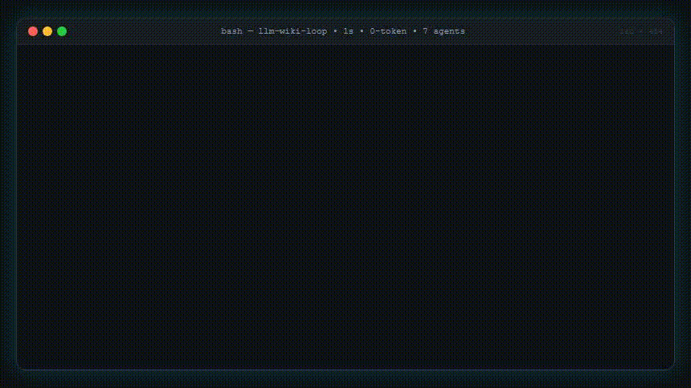

# llm-wiki-loop

> 🇯🇵 日本語版 — 英語版は [README.md](README.md) | 한국어版は [README.ko.md](README.ko.md) | ライブデモ: [EN](https://palan-k.github.io/llm-wiki-loop/) [JA](https://palan-k.github.io/llm-wiki-loop/ja/) [KO](https://palan-k.github.io/llm-wiki-loop/ko/)

<p align="center">
  <a href="https://github.com/PALAN-K/llm-wiki-loop/actions/workflows/ci.yml"></a>
  <a href="https://www.npmjs.com/package/llm-wiki-loop"></a>
  <a href="https://www.npmjs.com/package/llm-wiki-loop"></a>
  <a href="LICENSE"></a>
  <a href="https://agentskills.io"></a>
</p>

<p align="center">
  <b>自己改善型・自己組織化 LLM ナレッジボルトのためのプロダクションフレームワーク</b><br>
  <i>グラウンディング不変条件 • イベント駆動GC • 自動スキル化 • マルチエージェント・ワンクリック導入</i>
</p>

<p align="center">
  <a href="https://palan-k.github.io/llm-wiki-loop">
    
  </a>
</p>

<p align="center">
  <b>🌏 対応言語:</b> <a href="README.md">🇺🇸 English</a> • <a href="README.ja.md">🇯🇵 日本語</a> • <a href="README.ko.md">🇰🇷 한국어</a> &nbsp;|&nbsp; <b>🌐 ライブデモ:</b> <a href="https://palan-k.github.io/llm-wiki-loop/">EN</a> • <a href="https://palan-k.github.io/llm-wiki-loop/ja/">JA</a> • <a href="https://palan-k.github.io/llm-wiki-loop/ko/">KO</a> &nbsp;|&nbsp; <i>Zero-DB • 100% Markdown • 7エージェント • 25テスト • v1.3.1</i>
</p>

```bash
# ⚡ 1秒セットアップ: Zero DB/デーモン、100%ピュアMarkdownの3層ボルト + 7エージェント スキル注入
npx llm-wiki-loop init
```

<p align="center">
  
  <br><em>↑ One take — $ npx llm-wiki-loop init (0.8s, 7 agents) → $ check --strict (0 errors) → $ scan:skills (1 candidate) — 22s, 860×484</em>
</p>

---

### ⚡ なぜ通常のAIメモは失敗するのか vs. `llm-wiki-loop`

| ❌ 通常のAIメモ / Karpathy Wiki | ✅ `llm-wiki-loop` アーキテクチャ |
| :--- | :--- |
| **サイレントなハルシネーション**: AIが時間の経過とともに数値や引用を微妙に捏造する | **0トークンの機械的グラウンディング**: `check_evidence.py` がすべての事実を不変の `raw/` ソースに対して機械的に照合 |
| **高コストなコードドリフト**: セッションごとにコードベースを再読込し、トークンを大量消費 | **ユニバーサル Fingerprint**: `git diff` が監視対象コードを LLMトークンなしで0.01秒で検証 |
| **知識のサイロ化**: 修正がテキストのまま残り、エージェントが同じミスを繰り返す | **自動スキル化**: 頻発する修正（2回以上）が自動で永続的な `.agents/skills` へ昇格 |
| **フレームワークの肥大化**: 重いデータベースや複雑なサーバー構築が必要 | **ゼロ依存のシンプルさ**: 100% ピュアMarkdown（`raw/`、`wiki/`、`archive/`） |

<p align="center">
  
  <br><em>4-Stage Self-Improving Loop — 1秒 ingest → 0トークン verify → event GC &amp; 2× skillify (proposal-first)</em>
</p>

---

## 💡 llm-wiki-loop とは？

**llm-wiki-loop** は、不安定なAI出力を**不変で自己組織化する第二の脳**へと変換します。

多くのLLMメモは、徐々にハルシネーションを起こし、古い前提を引用したり、時間とともに肥大化します。**llm-wiki-loop** はこれをアーキテクチャ層で解決します：
- 🛡️ **ハルシネーションゼロの機械的グラウンディング**: `wiki/` 内のすべての数値・日付・引用は、`check_evidence.py`（新たに `--strict` / `--strict-all` の2段階対応）により不変の `raw/` ソースに対して機械的に検証されます。
- 🔍 **0トークンのコードドリフト検出**: Wiki記事は **ユニバーサル Fingerprint**（`Fingerprint: git:<hash>` とファイルごとの `sha256:<hex>`）でソースコードの実装を追跡し、セッション開始時のトークンコンテキストコストを99%削減します。
- ♻️ **自己組織化ボルト**: 古くなった事実は自動的に `Status: Outdated` または `Status: Disputed` のタグが付けられアーカイブされます — 削除されることはなく、完全な履歴の忠実性を保持します。
- ⚡ **自動スキル化による進化**: `log.md` に記録された繰り返しの解決策やエラー修正（2回以上）は、再利用可能なエージェントスキルへ自動的に昇格します。新しい `npm run scan:skills` が候補をオーバーヘッドゼロでレポートします。
- 🌏 **グローバル＆アクセシブルなショーケース**: `hreflang` 対応サイトマップ、キーボード操作可能なホイール、`prefers-reduced-motion` 対応を備えた EN/JA/KO ライブデモ（`/ja/` `/ko/`）を提供します。
- 🎯 **初心者でも摩擦ゼロ**: たった1つのコマンド（`npx llm-wiki-loop init`）で、**Claude Code、Cursor、Codex、OpenCode、Gemini、Windsurf、CommandCode** に構造化された知識を即座に装備できます。

---

## 🧬 自己組織化アーキテクチャとライフサイクル

<p align="center">
  
  <br><em>Lifecycle in 4.5s — cards slide, code types, drift flashes (860×220, 293KB MP4 / 376KB GIF)</em>
  <br><a href="https://palan-k.github.io/llm-wiki-loop"></a>
</p>

---

## 🔥 主要な柱：なぜ根本的に違うのか

| 機能 | 通常のAIメモ / RAG | **llm-wiki-loop** |
|---|---|---|
| **グラウンディング** | 確率的でハルシネーションが起こりやすい | **機械的に検証済み**: 数値や引用は raw ソースと一字一句一致する必要がある |
| **コードの鮮度** | セッションごとにコードファイルを盲目的に再読込（トークンを大量消費） | **0トークンのユニバーサル Fingerprint**: `git diff` がドリフトを0.01秒で検出、トークン浪費なし |
| **履歴と真実** | 静かに上書きまたは削除される | **Statusブロック + archive/**: 進化の監査ログを伴う不変の真実 |
| **ボルトの整理** | 手動キュレーション / 肥大化 | **イベント駆動GC**: 自己組織化するプログレッシブディスクロージャー（`index.md`） |
| **エージェントの可搬性** | ベンダーロックイン（単一IDE） | **ユニバーサルアダプター**: 7つ以上のAIエージェントランタイムへワンクリックでインストール |
| **自己進化** | 静的なプロンプト | **自動スキル化**: 頻繁なワークフローが自動化されたエージェントスキルへ進化 |

---

## 🎬 機能デモ — テキスト + GIF 1:1

<p align="center">
  <br>
  <b>A. Commit Gate</b><br><sub>git commit → <code>check_evidence 0 errors</code> → <code>index.md+log.md</code> 同時更新</sub>
</p>

<p align="center">
  <br>
  <b>B. Drift Detection</b><br><sub>編集 → <code>git diff</code> 0.01秒 → <code>Status: Outdated</code></sub>
</p>

<p align="center">
  <br>
  <b>C. Skill Evolution</b><br><sub><code>log.md</code> 2回 → <code>scan:skills</code> → <code>.agents/skills/</code></sub>
</p>

<p align="center">
  <br>
  <b>D. Multi-Agent</b><br><sub><code>npx llm-wiki-loop init</code> → 7エージェント 1秒</sub>
</p>

---

## ⚡ ユニバーサル Fingerprint と 0トークンのコードドリフト検出

LLMナレッジボルトをアクティブなソフトウェアエンジニアリングリポジトリに接続する際、Wiki記事をソースコードの変更と同期させ続けることは極めて重要です：

```markdown
# Authentication Architecture Overview
> Raw: [raw/notes/auth-v1.md](raw/notes/auth-v1.md)
> Fingerprint: git:5b237fa
> Monitored: src/auth/jwt.ts, src/auth/session.ts, package.json
```

1. **直感的**: ベースとなるGitコミットと監視対象ファイルを明確に示す、人間が読めるMarkdownヘッダー。
2. **超軽量（ゼロコンフィグ）**: 追加のデータベースもデーモンも不要。標準のGitバージョン管理をそのまま活用します。
3. **トークン＆コンピュート効率**: AIは無傷のコードベースを再読込するために何万トークンも浪費しません。`npx llm-wiki check .` がドリフトした記事をミリ秒で即座に特定します。


---

## 🚀 クイックスタート：真のワンクリック・エージェントセットアップ

プロジェクトのターミナルで**たった1つのコマンド**を実行してください：

```bash
npx llm-wiki-loop init
```

### ⚡ この1秒間で何が起こるのか？

1. 📂 **ナレッジボルトをカプセル化**: プロジェクトルートを汚染することなく、`./llm-wiki-loop/`（`raw/`、`wiki/`、`archive/`、`index.md`、`log.md`、`AGENTS.md`）に完全な3層ボルトを構築します。
2. 🏛️ **非破壊的な憲法リンク**: 既存のプロジェクトルールを上書きすることなく、ボルトプロトコルをプロジェクトルートの `AGENTS.md` に自動的にリンクします。
3. 🤖 **すべてのAIエージェントを装備**: **Claude Code、Cursor、Codex、Gemini、OpenCode、Windsurf、CommandCode** を自動検出し、`wiki-manager` スキルを注入します（未検出の場合は `.agents/skills/` にフォールバック）。
4. 🛡️ **トークン浪費ゼロ＆設定ゼロ**: グラウンディング不変条件、0トークンの git ドリフト検出、自動スキル化が即座に有効になります。

---

### 💡 日々のワークフロー（AIエージェントへのプロンプト）

`npx llm-wiki-loop init` を実行した後は、IDE / CLI 内でAIエージェントに単にプロンプトを送るだけです：

```text
Prompt to Agent:
"I dropped a paper in raw/notes/2026-08-17-analysis.md. Ingest it into wiki/topics/ and verify grounding."
```

AIエージェントはインストール済みの `wiki-manager` スキルを使用して、自動的にトリアージ、正確な逐語的な出典付きでのコンパイル、`index.md` と `log.md` の更新を行います。

---

## 🛠️ CLIコマンドとツール

組み込みCLI（`npx llm-wiki-loop` または `llm-wiki`）はクロスプラットフォーム（Windows、macOS、Linux）で動作します：

```
Usage:
  npx llm-wiki-loop <command> [options]
  llm-wiki <command> [options]

Commands:
  init [dir]          ✨ 1-Click setup: Scaffold vault & auto-install agent skill
                      (default: ./llm-wiki-loop. Pass '.' or --root for current project root)
  check [vaultDir]    🛡️ Run mechanical evidence verification (0-hallucination check)
                      [--strict: fail on errors/drift, --strict-all: also fail on suspects]
  doctor [vaultDir]   🩺 Diagnose Python environment, detected AI agent runtimes & vault schema
  install [options]   🤖 Manually inject/update wiki-manager skill into agent runtimes
  clean [dir]         🧹 Safely remove scaffolded vault files & unlinks constitution anchors
  version             🏷️ Print current package version
  help                ❓ Show help screen

Options for 'init':
  . or --root         Scaffold directly in the current working directory (for vault-only standalone repos)
  --no-install        Skip automatic agent skill installation (vault-only)
  --vault-only        Alias for --no-install

Options for 'install':
  --global, -g        Install to global user home directories (~/.claude, ~/.agents, etc.)
  --custom <path>     Install to a custom skill directory

Extras (npm scripts):
  npm run scan:skills  🔍 Report skill candidates from log.md (2+ repeats, 0 overhead)
  npm run sync:version 🔄 Sync package.json version → docs badges + sitemap (prepack)
```

---

## 📂 ボルト構造と責務

llm-wiki-loop は **埋め込みモード**（既存アプリ内）と **スタンドアロンモード**（専用ナレッジリポジトリ）の両方をサポートします：

### モード1: 埋め込みボルト（既存プロジェクト向け推奨）

```
<your-project>/
├── AGENTS.md                      # [LINKED] Project constitution (auto-linked with Vault Protocol)
├── .agents/skills/wiki-manager/   # [AGENT SKILL] Codex / Antigravity / Gemini runtime skill
├── .claude/skills/wiki-manager/   # [AGENT SKILL] Claude Code runtime skill
├── llm-wiki-loop/                 # [ISOLATED VAULT] Cleanly separated knowledge vault
│   ├── raw/                       # [IMMUTABLE] Sources: notes/, data/, assets/ (Never edited by LLM)
│   ├── wiki/                      # [LLM-OWNED] Compiled knowledge: concepts/, topics/, references/
│   ├── archive/                   # [SUPERSEDED] Historical snapshots (never cascade-updated)
│   ├── index.md                   # [CATALOG] Exactly 1 line per active wiki page (progressive disclosure)
│   ├── log.md                     # [AUDIT LEDGER] Append-only event log (## [YYYY-MM-DD] op | ...)
│   └── AGENTS.md                  # [CONSTITUTION] Vault rules & grounding invariants (< 50 lines)
├── src/                           # Your existing application code
└── package.json
```

### モード2: スタンドアロン・ナレッジボルト

```
<knowledge-vault>/
├── raw/                           # [IMMUTABLE] Sources: notes/, data/, assets/ (Never edited by LLM)
├── wiki/                          # [LLM-OWNED] Compiled knowledge: concepts/, topics/, references/
├── archive/                       # [SUPERSEDED] Historical snapshots (never cascade-updated)
├── index.md                       # [MAP] Exactly 1 line per active wiki page (progressive disclosure)
├── log.md                         # [AUDIT] Append-only event log (## [YYYY-MM-DD] op | ...)
└── AGENTS.md                      # [CONSTITUTION] Vault rules & grounding invariants (< 50 lines)
```

---

### 6つのコア・ボルト操作

すべての準拠エージェントは、6つのボルトライフサイクル操作を厳密に遵守します：

| 操作 | 目的 | ライフサイクルフロー |
|---|---|---|
| `init` | **ブートストラップ**: レイアウトの構築、エージェントスキルのインストール、スキーマの確立、index/logのセットアップ。 | CLI / Agent $\rightarrow$ Scaffold $\rightarrow$ Schema verification |
| `ingest` | **知識の吸収**: Rawソース $\rightarrow$ 4段階トリアージ $\rightarrow$ 逐語的な `Raw:` リンク付きのコンパイル済み知識。 | `raw/` $\rightarrow$ Triage (New / Update / Disputed) $\rightarrow$ `wiki/` $\rightarrow$ Sync `index.md` & `log.md` |
| `query` | **プログレッシブディスクロージャー**: 最小のトークン消費で高精度な回答取得。 | Read `index.md` (L1) $\rightarrow$ Targeted `wiki/` page read (L2) $\rightarrow$ Synthesize with citations |
| `lint` | **3段階ヘルスチェック**: 構造フォーマット、機械的エビデンス検証、判断レビュー。 | Schema check $\rightarrow$ `check_evidence.py` $\rightarrow$ Fix ungrounded claims |
| `loop` | **自己進化とGC**: イベント駆動のガベージコレクションと繰り返し解決策の自動スキル化。 | Detect outdated facts $\rightarrow$ Move to `archive/` $\rightarrow$ Detect 2+ recurring patterns $\rightarrow$ Promote to `SKILL.md` |
| `audit` | **スキルカバレッジ監査**: 既存スキルを公式ドキュメントと実行ログに対して評価。 | Log inspection $\rightarrow$ Gap analysis $\rightarrow$ Skill refinement |

---

## 🧠 Obsidian & AI IDE とのシームレスな統合

**llm-wiki-loop** はプレーンなMarkdownのみに依存しているため、既存のワークフローに自然に馴染みます：
- **Obsidian**: リポジトリまたは `llm-wiki-loop/` フォルダを直接開きます。`raw/assets/` をスクリーンショットや研究論文の添付フォルダとして設定してください。
- **Cursor & Windsurf**: ルールとスキルは `.cursor/skills/` または `.windsurf/skills/` に配置され、エディタ内のエージェントを即座に強化します。
- **Claude Code、Codex & Gemini**: ゼロセットアップのコマンドライン実行のために、標準の `.claude/skills/` および `.agents/skills/` 配布を利用します。

---

## 🤝 貢献とコミュニティ

オープンソースコミュニティからの貢献を歓迎します！
- ローカルテスト手順、マルチランタイムアダプターガイド、アーキテクチャ仕様については [CONTRIBUTING.md](CONTRIBUTING.md) をご覧ください。
- LLM-wiki標準の正式な規範仕様については [SPEC.md](SPEC.md) をご覧ください。

---

## 📄 ライセンスと謝辞

- **ライセンス**: [MIT](LICENSE)
- **概念的基盤**: LLM-Wikiパターン（不変のrawソース、LLMがコンパイルするwiki、グラウンディングループ）は [Andrej Karpathy氏のgist](https://gist.github.com/karpathy/442a6bf555914893e9891c11519de94f)（2026-04-04）に由来します。
- `check_evidence.py` は [Astro-Han/karpathy-llm-wiki](https://github.com/Astro-Han/karpathy-llm-wiki)（MIT）から適応されています。
