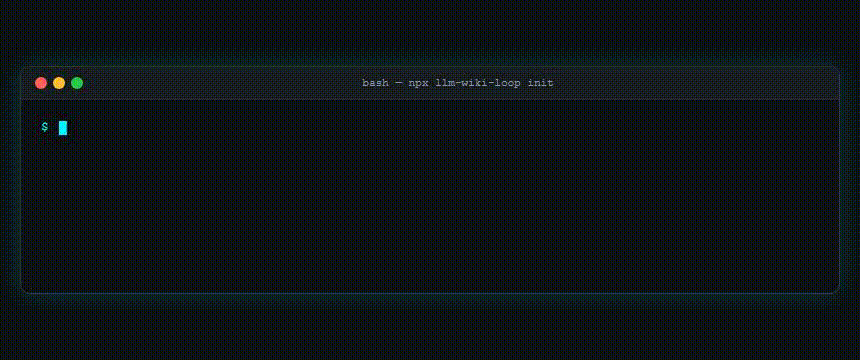
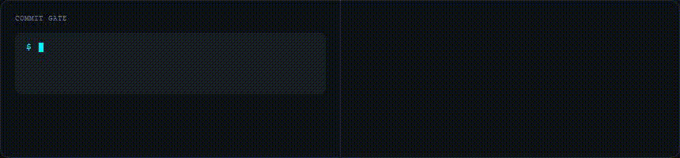
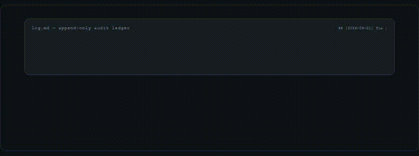

# llm-wiki-loop

> 🇰🇷 한국어판 — 영문은 [README.md](README.md) | 일본어판은 [README.ja.md](README.ja.md) | 라이브 데모: [EN](https://palan-k.github.io/llm-wiki-loop/) [JA](https://palan-k.github.io/llm-wiki-loop/ja/) [KO](https://palan-k.github.io/llm-wiki-loop/ko/)

<p align="center">
  <a href="https://github.com/PALAN-K/llm-wiki-loop/actions/workflows/ci.yml"></a>
  <a href="https://www.npmjs.com/package/llm-wiki-loop"></a>
  <a href="https://www.npmjs.com/package/llm-wiki-loop"></a>
  <a href="LICENSE"></a>
  <a href="https://agentskills.io"></a>
</p>

<p align="center">
  <b>자기 개선 · 자기 조직화 LLM 지식 볼트를 위한 프로덕션 프레임워크</b><br>
  <i>그라운딩 불변식 • 이벤트 기반 GC • 자동 스킬화 • 멀티 에이전트 원클릭 주입</i>
</p>

<p align="center">
  <a href="https://palan-k.github.io/llm-wiki-loop">
    
  </a>
</p>

<p align="center">
  <b>🌏 언어:</b> <a href="README.md">🇺🇸 English</a> • <a href="README.ja.md">🇯🇵 日本語</a> • <a href="README.ko.md">🇰🇷 한국어</a> &nbsp;|&nbsp; <b>🌐 라이브 데모:</b> <a href="https://palan-k.github.io/llm-wiki-loop/">EN</a> • <a href="https://palan-k.github.io/llm-wiki-loop/ja/">JA</a> • <a href="https://palan-k.github.io/llm-wiki-loop/ko/">KO</a> &nbsp;|&nbsp; <i>Zero-DB • 100% Markdown • 7개 에이전트 • 25개 테스트 • v1.3.1</i>
</p>

```bash
# ⚡ 1초 설정: Zero DB/데몬, 100% 순수 Markdown 3계층 볼트 + 7개 에이전트 스킬 주입
npx llm-wiki-loop init
```

<p align="center">
  
  <br><em>↑ Actual terminal — $ npx llm-wiki-loop init → 0.8s vault scaffold → 7 agents equipped (860×360, 270KB MP4 / 104KB GIF)</em>
</p>

---

### ⚡ 왜 일반 AI 메모는 실패하는가 vs. `llm-wiki-loop`

| ❌ 일반 AI 메모 / Karpathy Wiki | ✅ `llm-wiki-loop` 아키텍처 |
| :--- | :--- |
| **조용한 할루시네이션**: AI가 시간이 지남에 따라 수치와 인용을 은근히 날조 | **0-토큰 기계적 그라운딩**: `check_evidence.py`가 불변의 `raw/` 소스에 대해 100% 사실을 기계적으로 대조 |
| **비용이 큰 코드 드리프트**: 매 세션마다 코드베이스를 다시 읽어 $$$ 토큰을 소모 | **유니버설 Fingerprint**: `git diff`가 LLM 토큰 없이 0.01초 만에 감시 대상 코드를 검증 |
| **지식 사일로**: 수정 사항이 텍스트로만 남아 에이전트가 같은 오류를 반복 | **자동 스킬화**: 빈번한 수정(2회 이상)이 자동으로 영구적인 `.agents/skills`로 진화 |
| **프레임워크 비대화**: 무거운 데이터베이스와 복잡한 서버 구성 | **무의존 단순성**: 100% 순수 Markdown (`raw/`, `wiki/`, `archive/`) |

<p align="center">
  
  <br><em>4-Stage Self-Improving Loop — 1초 ingest → 0-토큰 verify → event GC &amp; 2× skillify (proposal-first)</em>
</p>

---

## 💡 llm-wiki-loop란?

**llm-wiki-loop**는 불안정한 AI 출력을 **불변의 자기 조직화 세컨드 브레인**으로 변환합니다.

대부분의 LLM 노트는 점차 할루시네이션을 일으키고, 오래된 가정을 인용하거나, 시간이 지남에 따라 비대해집니다. **llm-wiki-loop**는 이를 아키텍처 차원에서 해결합니다:
- 🛡️ **할루시네이션 제로 기계적 그라운딩**: `wiki/` 안의 모든 수치, 날짜, 인용은 `check_evidence.py` (새로운 `--strict`/`--strict-all` 2단계 지원)를 통해 불변의 `raw/` 소스에 대해 기계적으로 검증됩니다.
- 🔍 **0-토큰 코드 드리프트 감지**: Wiki 문서는 **유니버설 Fingerprint**(`Fingerprint: git:<hash>` 및 파일별 `sha256:<hex>`)로 소스 코드 구현을 추적하여 세션 시작 시 토큰 컨텍스트 비용을 99% 절감합니다.
- ♻️ **자기 조직화 볼트**: 오래된 사실은 자동으로 `Status: Outdated` 또는 `Status: Disputed` 태그가 부여되어 아카이브됩니다 — 삭제되지 않으며 완전한 히스토리 충실도를 보존합니다.
- ⚡ **자동 스킬화 진화**: `log.md`에 기록된 반복된 해결책과 오류 수정(2회 이상)은 재사용 가능한 에이전트 스킬로 자동 승격됩니다. 새로운 `npm run scan:skills`가 후보를 오버헤드 없이 보고합니다.
- 🌏 **글로벌 및 접근성 높은 쇼케이스**: `hreflang` 사이트맵, 키보드 탐색 가능한 휠, `prefers-reduced-motion` 지원을 갖춘 EN/JA/KO 라이브 데모(`/ja/` `/ko/`)를 제공합니다.
- 🎯 **초보자도 마찰 없는 경험**: 단 하나의 명령어(`npx llm-wiki-loop init`)로 **Claude Code, Cursor, Codex, OpenCode, Gemini, Windsurf, CommandCode**에 구조화된 지식을 즉시 장착합니다.

---

## 🧬 자기 조직화 아키텍처와 라이프사이클

<p align="center">
  
  <br><em>Lifecycle in 4.5s — cards slide, code types, drift flashes (860×220, 293KB MP4 / 376KB GIF)</em>
  <br><a href="https://palan-k.github.io/llm-wiki-loop"></a>
</p>

---

## 🔥 핵심 축: 왜 다르게 설계되었는가

| 기능 | 일반 AI 메모 / RAG | **llm-wiki-loop** |
|---|---|---|
| **그라운딩** | 확률적이고 할루시네이션에 취약 | **기계적으로 검증됨**: 수치와 인용은 raw 소스와 verbatim 일치해야 함 |
| **코드 최신성** | 매 세션마다 코드 파일을 맹목적으로 다시 읽음 ($$$ 토큰 소모) | **0-토큰 유니버설 Fingerprint**: `git diff`가 드리프트를 0.01초 만에 감지, 토큰 낭비 없음 |
| **히스토리와 진실** | 조용히 덮어쓰거나 삭제 | **Status 블록 + archive/**: 진화 감사 로그를 동반한 불변의 진실 |
| **볼트 정리** | 수동 큐레이션 / 비대화 | **이벤트 기반 GC**: 자기 조직화 점진적 공개(`index.md`) |
| **에이전트 이식성** | 벤더 종속(단일 IDE) | **유니버설 어댑터**: 7개 이상의 AI 에이전트 런타임에 원클릭 설치 |
| **자기 진화** | 정적 프롬프트 | **자동 스킬화**: 빈번한 워크플로가 자동화된 에이전트 스킬로 진화 |

---

## 🎬 기능 데모 — 텍스트 + GIF 1:1

<table>
<tr>
<td align="center" width="50%">
<br>
<b>A. Commit Gate</b><br><sub>git commit → <code>check_evidence 0 errors</code> → <code>index.md+log.md</code> 함께 업데이트</sub>
</td>
<td align="center" width="50%">
<br>
<b>B. Drift Detection</b><br><sub>코드 수정 → <code>git diff</code> 0.01초 → <code>Status: Outdated</code></sub>
</td>
</tr>
<tr>
<td align="center" width="50%">
<br>
<b>C. Skill Evolution</b><br><sub><code>log.md</code> 2회 반복 → <code>scan:skills</code> → <code>.agents/skills/</code></sub>
</td>
<td align="center" width="50%">
<br>
<b>D. Multi-Agent</b><br><sub><code>npx llm-wiki-loop init</code> → 7개 에이전트 1초 스탬프</sub>
</td>
</tr>
</table>

---

## ⚡ 유니버설 Fingerprint와 0-토큰 코드 드리프트 감지

LLM 지식 볼트를 활성화된 소프트웨어 엔지니어링 리포지토리에 연결할 때, wiki 문서를 소스 코드 변경과 동기화된 상태로 유지하는 것이 무엇보다 중요합니다:

```markdown
# Authentication Architecture Overview
> Raw: [raw/notes/auth-v1.md](raw/notes/auth-v1.md)
> Fingerprint: git:5b237fa
> Monitored: src/auth/jwt.ts, src/auth/session.ts, package.json
```

1. **직관적**: 기준 Git 커밋과 감시 대상 파일을 명확히 보여주는 사람이 읽을 수 있는 Markdown 헤더.
2. **초경량 (Zero-Config)**: 추가 데이터베이스 0개, 데몬 0개. 표준 Git 버전 관리를 그대로 활용합니다.
3. **토큰 및 컴퓨트 효율적**: AI는 손상되지 않은 코드베이스를 다시 읽기 위해 수만 토큰을 낭비하지 않습니다. `npx llm-wiki check .`가 드리프트된 문서를 밀리초 단위로 즉시 식별합니다.


---

## 🚀 빠른 시작: 진정한 원클릭 에이전트 설정

프로젝트 터미널에서 **단 하나의 명령어**만 실행하세요:

```bash
npx llm-wiki-loop init
```

### ⚡ 이 1초 동안 무슨 일이 일어나나요?
1. 📂 **지식 볼트 캡슐화**: 프로젝트 루트를 오염시키지 않고 `./llm-wiki-loop/`(`raw/`, `wiki/`, `archive/`, `index.md`, `log.md`, `AGENTS.md`)에 완전한 3계층 볼트를 구성합니다.
2. 🏛️ **비파괴적 컨스티튜션 연결**: 기존 프로젝트 규칙을 덮어쓰지 않고 볼트 프로토콜을 프로젝트 루트의 `AGENTS.md`에 자동으로 연결합니다.
3. 🤖 **모든 AI 에이전트 장착**: **Claude Code, Cursor, Codex, Gemini, OpenCode, Windsurf, CommandCode**를 자동으로 감지하고 `wiki-manager` 스킬을 주입합니다(감지되지 않으면 `.agents/skills/`로 대체).
4. 🛡️ **토큰 낭비 제로 및 설정 제로**: 그라운딩 불변식, 0-토큰 git 드리프트 감지, 자동 스킬화가 즉시 활성화됩니다.

---

### 💡 일일 워크플로 (AI 에이전트에게 프롬프트하기)

`npx llm-wiki-loop init`을 실행한 후에는 IDE / CLI 안에서 AI 에이전트에게 간단히 프롬프트하면 됩니다:

```text
Prompt to Agent:
"I dropped a paper in raw/notes/2026-08-17-analysis.md. Ingest it into wiki/topics/ and verify grounding."
```

AI 에이전트는 설치된 `wiki-manager` 스킬을 사용해 자동으로 트리아지하고, 정확한 verbatim 출처와 함께 컴파일하며, `index.md`와 `log.md`를 업데이트합니다.

---

## 🛠️ CLI 명령어와 도구

내장 CLI(`npx llm-wiki-loop` 또는 `llm-wiki`)는 크로스 플랫폼(Windows, macOS, Linux)에서 동작합니다:

```
Usage:
  npx llm-wiki-loop <command> [options]
  llm-wiki <command> [options]

Commands:
  init [dir]          ✨ 1-Click setup: Scaffold vault & auto-install agent skill
                      (default: ./llm-wiki-loop. Pass '.' or --root for current project root)
  check [vaultDir]    🛡️ Run mechanical evidence verification (0-hallucination check)
                      [--strict: fail on errors/drift, --strict-all: also fail on suspects]
  doctor [vaultDir]   🩺 Diagnose Python environment, detected AI agent runtimes & vault schema
  install [options]   🤖 Manually inject/update wiki-manager skill into agent runtimes
  clean [dir]         🧹 Safely remove scaffolded vault files & unlinks constitution anchors
  version             🏷️ Print current package version
  help                ❓ Show help screen

Options for 'init':
  . or --root         Scaffold directly in the current working directory (for vault-only standalone repos)
  --no-install        Skip automatic agent skill installation (vault-only)
  --vault-only        Alias for --no-install

Options for 'install':
  --global, -g        Install to global user home directories (~/.claude, ~/.agents, etc.)
  --custom <path>     Install to a custom skill directory

Extras (npm scripts):
  npm run scan:skills  🔍 Report skill candidates from log.md (2+ repeats, 0 overhead)
  npm run sync:version 🔄 Sync package.json version → docs badges + sitemap (prepack)
```

---

## 📂 볼트 구조와 역할

llm-wiki-loop는 **임베디드 모드**(기존 앱 내부)와 **스탠드얼론 모드**(전용 지식 리포지토리) 모두를 지원합니다:

### 모드 1: 임베디드 볼트 (기존 프로젝트에 권장)
```
<your-project>/
├── AGENTS.md                      # [LINKED] Project constitution (auto-linked with Vault Protocol)
├── .agents/skills/wiki-manager/   # [AGENT SKILL] Codex / Antigravity / Gemini runtime skill
├── .claude/skills/wiki-manager/   # [AGENT SKILL] Claude Code runtime skill
├── llm-wiki-loop/                 # [ISOLATED VAULT] Cleanly separated knowledge vault
│   ├── raw/                       # [IMMUTABLE] Sources: notes/, data/, assets/ (Never edited by LLM)
│   ├── wiki/                      # [LLM-OWNED] Compiled knowledge: concepts/, topics/, references/
│   ├── archive/                   # [SUPERSEDED] Historical snapshots (never cascade-updated)
│   ├── index.md                   # [CATALOG] Exactly 1 line per active wiki page (progressive disclosure)
│   ├── log.md                     # [AUDIT LEDGER] Append-only event log (## [YYYY-MM-DD] op | ...)
│   └── AGENTS.md                  # [CONSTITUTION] Vault rules & grounding invariants (< 50 lines)
├── src/                           # Your existing application code
└── package.json
```

### 모드 2: 스탠드얼론 지식 볼트
```
<knowledge-vault>/
├── raw/                           # [IMMUTABLE] Sources: notes/, data/, assets/ (Never edited by LLM)
├── wiki/                          # [LLM-OWNED] Compiled knowledge: concepts/, topics/, references/
├── archive/                       # [SUPERSEDED] Historical snapshots (never cascade-updated)
├── index.md                       # [MAP] Exactly 1 line per active wiki page (progressive disclosure)
├── log.md                         # [AUDIT] Append-only event log (## [YYYY-MM-DD] op | ...)
└── AGENTS.md                      # [CONSTITUTION] Vault rules & grounding invariants (< 50 lines)
```

---

### 6가지 핵심 볼트 오퍼레이션

모든 규격 준수 에이전트는 6가지 볼트 라이프사이클 오퍼레이션을 엄격히 따릅니다:

| 오퍼레이션 | 목적 | 라이프사이클 흐름 |
|---|---|---|
| `init` | **부트스트랩**: 레이아웃 구성, 에이전트 스킬 설치, 스키마 확립, index/log 설정. | CLI / Agent $\rightarrow$ Scaffold $\rightarrow$ Schema verification |
| `ingest` | **지식 흡수**: Raw 소스 $\rightarrow$ 4단계 트리아지 $\rightarrow$ verbatim `Raw:` 링크가 포함된 컴파일된 지식. | `raw/` $\rightarrow$ Triage (New / Update / Disputed) $\rightarrow$ `wiki/` $\rightarrow$ Sync `index.md` & `log.md` |
| `query` | **점진적 공개**: 최소 토큰 소비로 고정밀 답변 검색. | Read `index.md` (L1) $\rightarrow$ Targeted `wiki/` page read (L2) $\rightarrow$ Synthesize with citations |
| `lint` | **3단계 헬스 체크**: 구조적 포맷, 기계적 근거 검증, 판단 검토. | Schema check $\rightarrow$ `check_evidence.py` $\rightarrow$ Fix ungrounded claims |
| `loop` | **자기 진화와 GC**: 이벤트 기반 가비지 컬렉션과 반복된 해결책의 자동 스킬화. | Detect outdated facts $\rightarrow$ Move to `archive/` $\rightarrow$ Detect 2+ recurring patterns $\rightarrow$ Promote to `SKILL.md` |
| `audit` | **스킬 커버리지 감사**: 기존 스킬을 공식 문서와 실행 로그에 대해 평가. | Log inspection $\rightarrow$ Gap analysis $\rightarrow$ Skill refinement |

---

## 🧠 Obsidian 및 AI IDE와의 매끄러운 통합

**llm-wiki-loop**는 순수 Markdown에만 의존하므로 기존 워크플로에 자연스럽게 녹아듭니다:
- **Obsidian**: 리포지토리 또는 `llm-wiki-loop/` 폴더를 직접 여세요. `raw/assets/`를 스크린샷과 연구 논문용 첨부 폴더로 설정하세요.
- **Cursor & Windsurf**: 규칙과 스킬은 `.cursor/skills/` 또는 `.windsurf/skills/`에 위치하여 에디터 내 에이전트를 즉시 강화합니다.
- **Claude Code, Codex & Gemini**: 제로 설정 명령줄 실행을 위해 표준 `.claude/skills/` 및 `.agents/skills/` 배포를 사용합니다.

---

## 🤝 기여와 커뮤니티

오픈소스 커뮤니티의 기여를 환영합니다!
- 로컬 테스트 방법, 멀티 런타임 어댑터 가이드, 아키텍처 명세는 [CONTRIBUTING.md](CONTRIBUTING.md)를 확인하세요.
- LLM-wiki 표준의 정식 규범 명세는 [SPEC.md](SPEC.md)를 참고하세요.

---

## 📄 라이선스 및 감사의 말

- **라이선스**: [MIT](LICENSE)
- **개념적 기반**: LLM-Wiki 패턴(불변의 raw 소스, LLM이 컴파일하는 wiki, 그라운딩 루프)은 [Andrej Karpathy의 gist](https://gist.github.com/karpathy/442a6bf555914893e9891c11519de94f)(2026-04-04)에서 유래했습니다.
- `check_evidence.py`는 [Astro-Han/karpathy-llm-wiki](https://github.com/Astro-Han/karpathy-llm-wiki)(MIT)에서 개작되었습니다.
