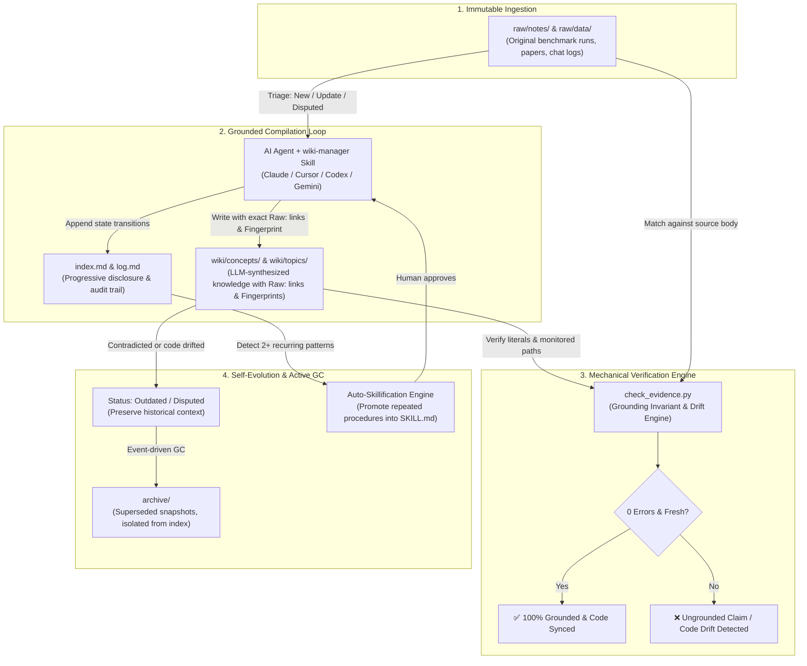

# llm-wiki-loop

<p align="center">
  <a href="https://github.com/PALAN-K/llm-wiki-loop/actions/workflows/ci.yml"></a>
  <a href="https://www.npmjs.com/package/llm-wiki-loop"></a>
  <a href="https://www.npmjs.com/package/llm-wiki-loop"></a>
  <a href="LICENSE"></a>
  <a href="https://agentskills.io"></a>
</p>

<p align="center">
  <b>The Production Framework for Self-Improving & Self-Organizing LLM Knowledge Vaults.</b><br>
  <i>Grounding Invariants • Event-Driven GC • Auto-Skillification • Multi-Agent 1-Click Injection</i>
</p>

<p align="center">
  <a href="https://palan-k.github.io/llm-wiki-loop">
    
  </a>
</p>

```bash
# ⚡ 1-Second Setup: Zero DB/daemons, 100% pure Markdown 3-layer vault + 7-Agent skill injection
npx llm-wiki-loop init
```

---

### ⚡ Why Ordinary AI Notes Fail vs. `llm-wiki-loop`

| ❌ Ordinary AI Notes / Karpathy Wiki | ✅ `llm-wiki-loop` Architecture |
| :--- | :--- |
| **Silent Hallucinations**: AI subtly fabricates numbers & quotes over time | **0-Token Machine Grounding**: `check_evidence.py` mechanically matches 100% of facts against immutable `raw/` sources |
| **Expensive Code Drift**: Re-reading codebase every session burns $$$ tokens | **Universal Fingerprint**: `git diff` checks monitored code in 0.01s without LLM tokens |
| **Knowledge Silos**: Fixes stay as text; agent repeats the same errors | **Auto-Skillification**: Frequent fixes (2+) automatically evolve into permanent `.agents/skills` |
| **Framework Bloat**: Heavy databases, complex server setups | **Zero-Dependency Simplicity**: 100% pure Markdown (`raw/`, `wiki/`, `archive/`) |

---

## 💡 What is llm-wiki-loop?

**llm-wiki-loop** transforms volatile AI outputs into an **immutable, self-organizing second brain**. 

Most LLM notes gradually hallucinate, cite outdated assumptions, or bloat over time. **llm-wiki-loop** fixes this at the architectural layer:
- 🛡️ **0-Hallucination Machine Grounding**: Every number, date, and quote in `wiki/` is mechanically verified against immutable `raw/` sources using `check_evidence.py`.
- 🔍 **0-Token Code Drift Detection**: Wiki articles track source code implementations with **Universal Fingerprints** (`Fingerprint: git:<hash>` & `Monitored: <paths>`), saving 99% of token context costs on session startup.
- ♻️ **Self-Organizing Vault**: Outdated facts are automatically tagged `Status: Outdated` or `Status: Disputed` and archived—never deleted, preserving complete historical fidelity.
- ⚡ **Auto-Skillify Evolution**: Repeated solutions and error fixes (2+ times) logged in `log.md` are automatically promoted into reusable agent skills.
- 🎯 **Zero Friction for Beginners**: One command (`npx llm-wiki-loop init`) instantly equips **Claude Code, Cursor, Codex, OpenCode, Gemini, Windsurf, and CommandCode** with structured knowledge.

---

## 🧬 Self-Organizing Architecture & Lifecycle



---

## 🔥 Key Pillars: Why It's Built Differently

| Capability | Ordinary AI Notes / RAG | **llm-wiki-loop** |
|---|---|---|
| **Grounding** | Probabilistic, hallucination-prone | **Mechanically verified**: numbers & quotes must match raw sources verbatim |
| **Code Freshness** | Blindly re-reads code files every session ($$$ tokens) | **0-Token Universal Fingerprint**: `git diff` detects drift in 0.01s without token waste |
| **History & Truth** | Silently overwrites or deletes | **Status blocks + archive/**: immutable truth with evolutionary audit logs |
| **Vault Organization** | Manual curation / bloat | **Event-based GC**: self-organizing progressive disclosure (`index.md`) |
| **Agent Portability** | Vendor lock-in (single IDE) | **Universal Adapter**: 1-click install across 7+ AI agent runtimes |
| **Self-Evolution** | Static prompts | **Auto-skillifying**: frequent workflows evolve into automated agent skills |

---

## ⚡ Universal Fingerprint & 0-Token Code Drift Detection

When connecting your LLM knowledge vault to an active software engineering repository, keeping wiki articles synchronized with source code changes is paramount:

```markdown
# Authentication Architecture Overview
> Raw: [raw/notes/auth-v1.md](raw/notes/auth-v1.md)
> Fingerprint: git:5b237fa
> Monitored: src/auth/jwt.ts, src/auth/session.ts, package.json
```

1. **Intuitive**: Human-readable markdown header clearly stating the baseline Git commit and monitored files.
2. **Ultra-lightweight (Zero-Config)**: 0 extra databases, 0 daemons. Fully leverages standard Git version control.
3. **Token & Compute Efficient**: AI does not waste tens of thousands of tokens re-reading intact codebases. `npx llm-wiki check .` immediately identifies drifted articles in milliseconds.


---

## 🚀 Quickstart: True 1-Click Agent Setup

Run **just one command** in your project terminal:

```bash
npx llm-wiki-loop init
```

### ⚡ What Happens in that 1 Second?
1. 📂 **Capsules Knowledge Vault**: Scaffolds a complete 3-layer vault in `./llm-wiki-loop/` (`raw/`, `wiki/`, `archive/`, `index.md`, `log.md`, `AGENTS.md`) without polluting your project root.
2. 🤖 **Equips All AI Agents**: Automatically detects and injects the `wiki-manager` skill into **Claude Code, Cursor, Codex, Gemini, OpenCode, Windsurf, and CommandCode** (or defaults to `.agents/skills/`).
3. 🛡️ **Zero Token Waste & Zero Config**: Grounding invariants, 0-token git drift detection, and auto-skillification are active immediately.

---

### 💡 Daily Workflow (Prompt Your AI Agent)

After running `npx llm-wiki-loop init`, simply prompt your AI agent inside your IDE / CLI:

```text
Prompt to Agent:
"I dropped a paper in raw/notes/2026-08-17-analysis.md. Ingest it into wiki/topics/ and verify grounding."
```

Your AI agent uses the installed `wiki-manager` skill to automatically triage, compile with exact verbatim provenance, and update `index.md` & `log.md`.

---

## 🛠️ CLI Commands & Tooling

The built-in CLI (`npx llm-wiki-loop` or `llm-wiki`) works cross-platform (Windows, macOS, Linux):

```
Usage:
  npx llm-wiki-loop <command> [options]
  llm-wiki <command> [options]

Commands:
  init [dir]          ✨ 1-Click setup: Scaffold vault & auto-install agent skill
                      (default: ./llm-wiki-loop. Pass '.' or --root for current project root)
  check [vaultDir]    🛡️ Run mechanical evidence verification (0-hallucination check)
  doctor [vaultDir]   🩺 Diagnose Python environment, detected AI agent runtimes & vault schema
  install [options]   🤖 Manually inject/update wiki-manager skill into agent runtimes
  clean [dir]         🧹 Safely remove scaffolded vault files (rollback)
  version             🏷️ Print current package version
  help                ❓ Show help screen

Options for 'init':
  . or --root         Scaffold directly in the current working directory (for vault-only standalone repos)
  --no-install        Skip automatic agent skill installation (vault-only)
  --vault-only        Alias for --no-install

Options for 'install':
  --global, -g        Install to global user home directories (~/.claude, ~/.agents, etc.)
  --custom <path>     Install to a custom skill directory
```

---

## 📂 Vault Structure & Responsibilities

llm-wiki-loop supports both **embedded mode** (inside existing apps) and **standalone mode** (dedicated knowledge repo):

### Mode 1: Embedded Vault (Recommended for Existing Projects)
```
<your-project>/
├── .agents/skills/wiki-manager/   # [AGENT SKILL] Codex / Antigravity / Gemini runtime skill
├── .claude/skills/wiki-manager/   # [AGENT SKILL] Claude Code runtime skill
├── llm-wiki-loop/                 # [ISOLATED VAULT] Cleanly separated knowledge vault
│   ├── raw/                       # [IMMUTABLE] Sources: notes/, data/, assets/ (Never edited by LLM)
│   ├── wiki/                      # [LLM-OWNED] Compiled knowledge: concepts/, topics/, references/
│   ├── archive/                   # [SUPERSEDED] Historical snapshots (never cascade-updated)
│   ├── index.md                   # [MAP] Exactly 1 line per active wiki page (progressive disclosure)
│   ├── log.md                     # [AUDIT] Append-only event log (## [YYYY-MM-DD] op | ...)
│   └── AGENTS.md                  # [CONSTITUTION] Vault rules & grounding invariants (< 50 lines)
├── src/                           # Your existing application code
└── package.json
```

### Mode 2: Standalone Knowledge Vault
```
<knowledge-vault>/
├── raw/                           # [IMMUTABLE] Sources: notes/, data/, assets/ (Never edited by LLM)
├── wiki/                          # [LLM-OWNED] Compiled knowledge: concepts/, topics/, references/
├── archive/                       # [SUPERSEDED] Historical snapshots (never cascade-updated)
├── index.md                       # [MAP] Exactly 1 line per active wiki page (progressive disclosure)
├── log.md                         # [AUDIT] Append-only event log (## [YYYY-MM-DD] op | ...)
└── AGENTS.md                      # [CONSTITUTION] Vault rules & grounding invariants (< 50 lines)
```

---

### The 6 Core Vault Operations

Every conformant agent strictly adheres to the 6 vault lifecycle operations:

| Operation | Purpose | Lifecycle Flow |
|---|---|---|
| `init` | **Bootstrap**: Scaffolds layout, installs agent skills, establishes schema, and sets up index/log. | CLI / Agent $\rightarrow$ Scaffold $\rightarrow$ Schema verification |
| `ingest` | **Knowledge Absorption**: Raw sources $\rightarrow$ 4-tier triage $\rightarrow$ Compiled knowledge with verbatim `Raw:` links. | `raw/` $\rightarrow$ Triage (New / Update / Disputed) $\rightarrow$ `wiki/` $\rightarrow$ Sync `index.md` & `log.md` |
| `query` | **Progressive Disclosure**: High-precision answer retrieval with minimal token consumption. | Read `index.md` (L1) $\rightarrow$ Targeted `wiki/` page read (L2) $\rightarrow$ Synthesize with citations |
| `lint` | **3-Tier Health Check**: Structural formatting, mechanical evidence verification, and judgment review. | Schema check $\rightarrow$ `check_evidence.py` $\rightarrow$ Fix ungrounded claims |
| `loop` | **Self-Evolution & GC**: Event-driven garbage collection and auto-skillification of repeated solutions. | Detect outdated facts $\rightarrow$ Move to `archive/` $\rightarrow$ Detect 2+ recurring patterns $\rightarrow$ Promote to `SKILL.md` |
| `audit` | **Skill Coverage Audit**: Evaluates existing skills against official docs and execution logs. | Log inspection $\rightarrow$ Gap analysis $\rightarrow$ Skill refinement |

---

## 🧠 Seamless Integration with Obsidian & AI IDEs

Because **llm-wiki-loop** relies exclusively on plain Markdown, it fits naturally into existing workflows:
- **Obsidian**: Open the repository or `llm-wiki-loop/` folder directly. Configure `raw/assets/` as the attachment folder for screenshots and research papers.
- **Cursor & Windsurf**: Rules and skills reside in `.cursor/skills/` or `.windsurf/skills/`, instantly empowering the in-editor agent.
- **Claude Code, Codex & Gemini**: Uses standard `.claude/skills/` and `.agents/skills/` distribution for zero-setup command line execution.

---

## 🤝 Contributing & Community

We welcome contributions from the open-source community! 
- Check out [CONTRIBUTING.md](CONTRIBUTING.md) for local testing instructions, multi-runtime adapter guides, and architecture specifications.
- Read [SPEC.md](SPEC.md) for the formal normative specification of the LLM-wiki standard.

---

## 📄 License & Acknowledgments

- **License**: [MIT](LICENSE)
- **Conceptual Grounding**: The LLM-Wiki pattern (immutable raw sources, LLM-compiled wiki, grounding loop) originated from [Andrej Karpathy's gist](https://gist.github.com/karpathy/442a6bf555914893e9891c11519de94f) (2026-04-04).
- `check_evidence.py` is adapted from [Astro-Han/karpathy-llm-wiki](https://github.com/Astro-Han/karpathy-llm-wiki) (MIT).
