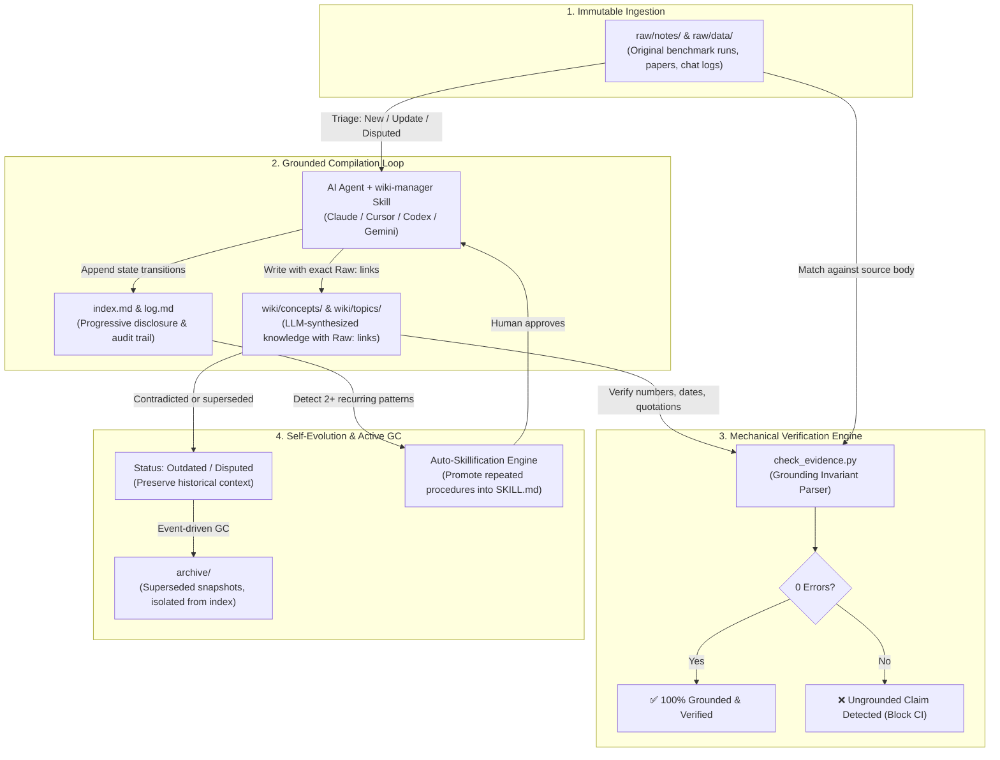

# llm-wiki-loop

<p align="center">
  <a href="https://github.com/PALAN-K/llm-wiki-loop/actions/workflows/ci.yml"></a>
  <a href="https://www.npmjs.com/package/llm-wiki-loop"></a>
  <a href="https://www.npmjs.com/package/llm-wiki-loop"></a>
  <a href="LICENSE"></a>
  <a href="https://agentskills.io"></a>
</p>

<p align="center">
  <b>The Production Framework for Self-Improving & Self-Organizing LLM Knowledge Vaults.</b><br>
  <i>Grounding Invariants • Event-Driven GC • Auto-Skillification • Multi-Agent 1-Click Injection</i>
</p>

<p align="center">
  <a href="https://palan-k.github.io/llm-wiki-loop">
    
  </a>
</p>

---

## 💡 What is llm-wiki-loop?

**llm-wiki-loop** transforms volatile AI outputs into an **immutable, self-organizing second brain**. 

Most LLM notes gradually hallucinate, cite outdated assumptions, or bloat over time. **llm-wiki-loop** fixes this at the architectural layer:
- 🛡️ **0-Hallucination Machine Grounding**: Every number, date, and quote in `wiki/` is mechanically verified against immutable `raw/` sources using `check_evidence.py`.
- ♻️ **Self-Organizing Vault**: Outdated facts are automatically tagged `Status: Outdated` or `Status: Disputed` and archived—never deleted, preserving complete historical fidelity.
- ⚡ **Auto-Skillify Evolution**: Repeated solutions and error fixes (2+ times) logged in `log.md` are automatically promoted into reusable agent skills.
- 🎯 **Zero Friction for Beginners**: One command (`npx llm-wiki-loop init`) instantly equips **Claude Code, Cursor, Codex, OpenCode, Gemini, Windsurf, and CommandCode** with structured knowledge.

---

## 🧬 Self-Organizing Architecture & Lifecycle



---

## 🔥 Key Pillars: Why It's Built Differently

| Capability | Ordinary AI Notes / RAG | **llm-wiki-loop** |
|---|---|---|
| **Grounding** | Probabilistic, hallucination-prone | **Mechanically verified**: numbers & quotes must match raw sources verbatim |
| **History & Truth** | Silently overwrites or deletes | **Status blocks + archive/**: immutable truth with evolutionary audit logs |
| **Vault Organization** | Manual curation / bloat | **Event-based GC**: self-organizing progressive disclosure (`index.md`) |
| **Agent Portability** | Vendor lock-in (single IDE) | **Universal Adapter**: 1-click install across 7+ AI agent runtimes |
| **Self-Evolution** | Static prompts | **Auto-skillifying**: frequent workflows evolve into automated agent skills |

---

## 🚀 Quickstart (1-Minute Setup)

### Option A: Direct Execution via NPX (No Installation Needed)
```bash
# 1. Scaffold a conformant LLM-wiki vault in your current directory (or ./llm-wiki-loop)
npx llm-wiki-loop init

# 2. Check local environment & detect installed AI agent runtimes
npx llm-wiki-loop doctor

# 3. Verify grounding invariants across your vault
npx llm-wiki-loop check .
```

### Option B: Global Installation (Auto-injects to AI Runtimes)
```bash
npm install -g llm-wiki-loop
```

Once installed, simply prompt your favorite AI agent in the repository:
```
set up my vault for <your domain>
```

---

## 🛠️ CLI Commands & Tooling

The built-in CLI (`llm-wiki`) provides an intuitive developer experience across all operating systems (Windows, macOS, Linux):

```
Usage: llm-wiki <command> [options]

Commands:
  doctor [vaultDir]   Diagnose Python runtime, agent skill directories, and vault schema
  check [vaultDir]    Run mechanical evidence verification (0-hallucination check)
  init [dir]          Scaffold standard raw/, wiki/, archive/, index.md, and log.md
  clean [dir]         Clean/uninstall scaffolded vault files safely
  install [options]   Inject wiki-manager skill into detected agent runtimes
  version             Print version
  help                Show help screen

Options for 'install':
  --global, -g        Install to global user home directories (~/.claude, ~/.agents, etc.)
  --custom <path>     Install to a custom skill directory
```

---

## 📂 Vault Structure & Responsibilities

```
<project-root>/
├── raw/                   # [IMMUTABLE] Sources: notes/, data/, assets/ (Never edited by LLM)
├── wiki/                  # [LLM-OWNED] Compiled knowledge: concepts/, topics/, references/
├── archive/               # [SUPERSEDED] Historical snapshots (never cascade-updated)
├── index.md               # [MAP] Exactly 1 line per active wiki page (progressive disclosure)
├── log.md                 # [AUDIT] Append-only event log (## [YYYY-MM-DD] op | ...)
├── AGENTS.md              # [CONSTITUTION] Vault rules & grounding invariants (< 50 lines)
├── bin/cli.js             # [TOOLING] Cross-platform Node.js + Python runner
└── skills/wiki-manager/   # [SKILL] Core skill implementing the 6 vault operations
```

### The 6 Core Vault Operations

| Operation | Purpose |
|---|---|
| `init` | Scaffolds layout, installs skill, establishes schema, and compiles initial seed pages. |
| `ingest` | Raw source $\rightarrow$ Triage (New / Update / Disputed / No material) $\rightarrow$ Compile $\rightarrow$ Index & Log sync. |
| `query` | Progressive disclosure query: `index.md` scan $\rightarrow$ targeted full-text retrieval $\rightarrow$ cited answer. |
| `lint` | 3-tier inspection: schema formatting, mechanical evidence verification, and judgment review. |
| `loop` | Event-driven GC, auto-skillifying candidate detection, and skill health audits. |
| `audit` | Evaluates skill coverage against official documentation and live usage logs. |

---

## 🧠 Seamless Integration with Obsidian & AI IDEs

Because **llm-wiki-loop** relies exclusively on plain Markdown, it fits naturally into existing workflows:
- **Obsidian**: Open the repository folder directly. Configure `raw/assets/` as the attachment folder for screenshots and research papers.
- **Cursor & Windsurf**: Rules and skills reside in `.cursor/skills/` or `.windsurf/skills/`, instantly empowering the in-editor agent.
- **Claude Code & Codex**: Uses standard `.claude/skills/` and `.agents/skills/` distribution for zero-setup command line execution.

---

## 🤝 Contributing & Community

We welcome contributions from the open-source community! 
- Check out [CONTRIBUTING.md](CONTRIBUTING.md) for local testing instructions, multi-runtime adapter guides, and architecture specifications.
- Read [SPEC.md](SPEC.md) for the formal normative specification of the LLM-wiki standard.

---

## 📄 License & Acknowledgments

- **License**: [MIT](LICENSE)
- **Conceptual Grounding**: The LLM-Wiki pattern (immutable raw sources, LLM-compiled wiki, grounding loop) originated from [Andrej Karpathy's gist](https://gist.github.com/karpathy/442a6bf555914893e9891c11519de94f) (2026-04-04).
- `check_evidence.py` is adapted from [Astro-Han/karpathy-llm-wiki](https://github.com/Astro-Han/karpathy-llm-wiki) (MIT).